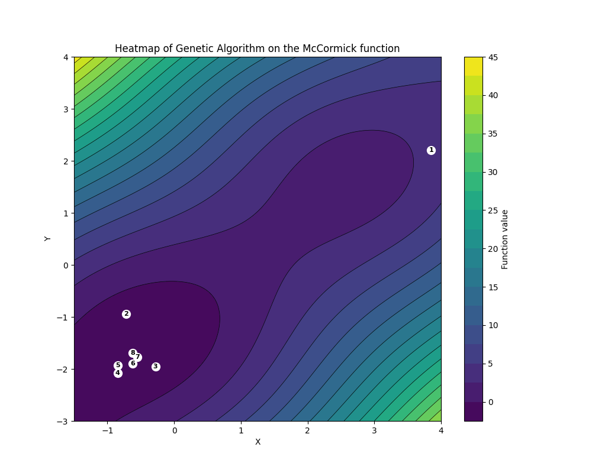

# Examples

## McCormick Function

The McCormick function is a multimodal function that is commonly used to test optimization algorithms. It is defined as `f(x,y) = sin(x + y) + (x - y)**2 - 1.5*x + 2.5*y + 1` along the domain `[-1.5, 4] x [-3, 4]`. The global minimum of this function is located at `f(-0.54719, -1.54719) = -1.9133`.

We implement the McCormick function as follows (note `genetic` maximizes fitness, so we negate the function):
```python
def fitness(params):
    x, y = params
    return -(np.sin(x + y) + (x - y)**2 - 1.5*x + 2.5*y + 1)
```

We then implement our mutation function to scale our parameters randomly, while staying within our search space:
```python
import random
def mutate(params):
    new_params = params[:]
    index = random.randint(0, len(params) - 1)
    new_params[index] *= random.uniform(0, 2)
    new_params[0] = max(-1.5, min(4, new_params[0]))
    new_params[1] = max(-3, min(4, new_params[0]))
    return new_params
```

We implement our generation function to randomly generate parameters:
```python
import random
def generate():
        return [random.uniform(-1.5, 4), random.uniform(-3, 4)]
```

Finally, we run our genetic algorithm. We choose to run the algorithm for 10 generations, with 50 candidate solutions in each, using 5 parents and implementing elitism with 5 survivors:
```python
result = quickopt.genetic_double(objective, mutate, generate, generations=10, population_size=50, reproduction_ct=5, survivor_ct=5, verbose=1)
```

The following is a heatmap of the optimization process, with each point representing a new optimal solution found by the algorithm:




